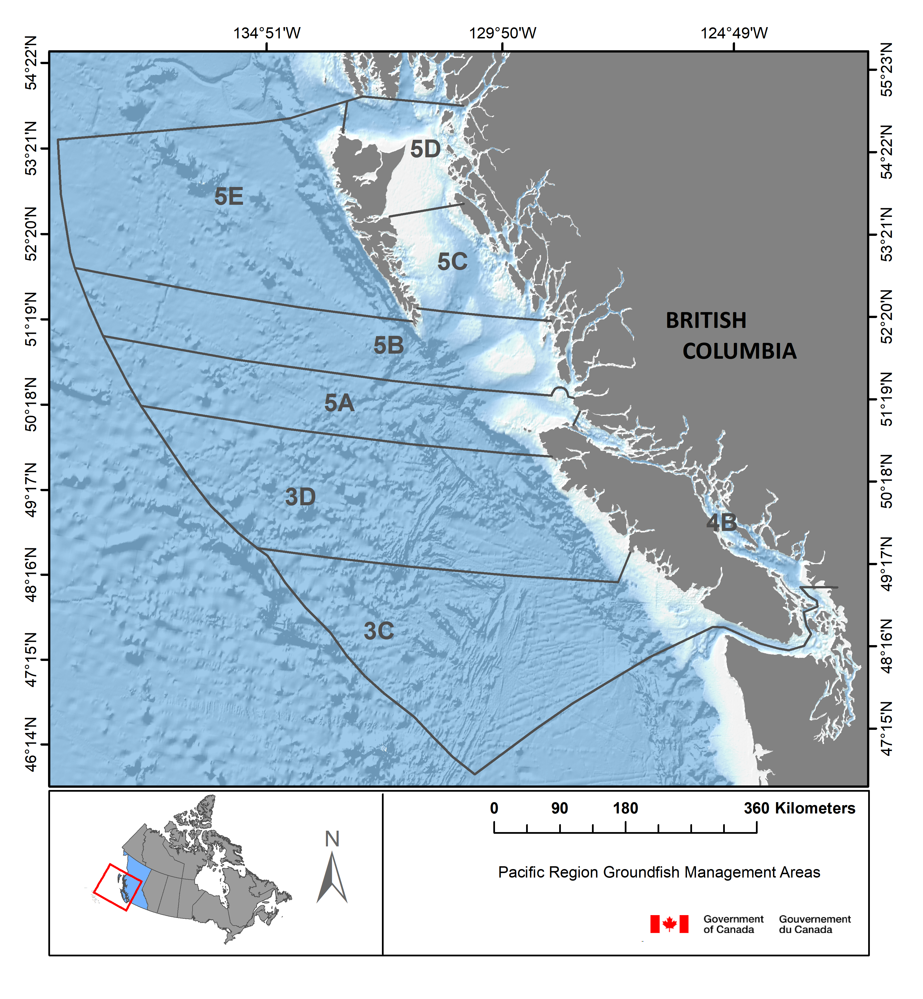

---
output:
  html_document: default
  keep_tex: yes
  word_document: default
  pdf_document: default
---


### How has the COVID-19 lockdown impacted landings in the Pacific Canada groundfish fishery?

**B. Connors and L. Lacko **

Quantitative Assessment Methods Section, Pacific Region, DFO  

`r Sys.Date()`   


This document briefly describes analyses of COVID-19 associated change in landings in the integrated groundfish fishery in Pacific Canada. 

Data for these analyses were queried from GFFOS, a groundfsh-specific view of the Pacific Regional Fishery Operations System (FOS) database.  Groundfish fisheries include the directed Rockfish, Spiny Dogfish, Lingcod, Halibut, Sablefish, and Trawl fisheries in Pacific waters (Figure 1).  Official catch estimates were derived from the ratio of total weight landed from the dockside monitoring program to the total of all retained catch weights from the logbook program.

All code and associated data to reproduce this document can be found on Github [here](https://github.com/brendanmichaelconnors/PAN-E_Pac-groundfish-landings-COVID). 

```{r echo=FALSE, fig.align = "center",out.width='90%'}


```
Figure 1. Pacific Canada Fishery Management Areas.

#####**1. Load required packages and landings and effort data**
```{r , message=FALSE, warning=FALSE, echo=TRUE}

library(tidyverse)
library(dplyr)
library(ggsidekick)
library(rstanarm) 
library(lme4)

catch_effort <- read.csv("CatchByMonthGear.csv")
catch_effort$log_land <- log(catch_effort$landed_kg)
catch_effort$month <- as.factor(catch_effort$month)
catch_effort$month_n <- as.numeric(catch_effort$month)
```

#####**2. What do landings (in kg) look like by species (top 20 by weight)?**  
```{r }
landed_spp <- catch_effort %>%
  group_by(SPECIES_COMMON_NAME) %>%
  dplyr::summarise(landings = sum(landed_kg))%>%
  arrange(desc(landings))%>%
  as.data.frame()

landed_spp[1:20,]
```
Wow that is a lot of Hake fish fingers.

#####**3. What do landings look like by month over time?**
```{r }
agg_landed_spp <- catch_effort %>%
  group_by(year, month) %>%
  summarise(landings = sum(landed_kg), n = n())%>%
  as.data.frame()

ggplot(agg_landed_spp, aes(x= month, y = (landings/100000)))+
  geom_bar(stat="identity")+
  facet_wrap(~ year) +
  theme_sleek() 
```

Landings clearly vary over the course of the year with peak landings typically occurring over the summer. There is no uber obvious decline in landings in the spring/summer of 2020 coincident with COVID (note that landings in July should be interpreted with caution due to potentially incomplete reporting). But landings are dominated by Hake, so let's look at a few of the most commonly landed species individually.

#####**4. What do species specific landings (top 10) look like over time?** 

```{r }
ind_landed_spp <- catch_effort %>%
  group_by(year, month,SPECIES_COMMON_NAME) %>%
  summarise(landings = sum(landed_kg))%>%
  as.data.frame()

ggplot(ind_landed_spp[ind_landed_spp$SPECIES_COMMON_NAME=="PACIFIC HAKE",], aes(x= month, y = (landings/100000)))+
  geom_bar(stat="identity")+
  facet_wrap(~ year) +
  theme_sleek()+
  ggtitle("Hake")
  
ggplot(ind_landed_spp[ind_landed_spp$SPECIES_COMMON_NAME=="ARROWTOOTH FLOUNDER",], aes(x= month, y = (landings/100000)))+
  geom_bar(stat="identity")+
  facet_wrap(~ year) +
  theme_sleek()+
  ggtitle("Arrowtooth")

ggplot(ind_landed_spp[ind_landed_spp$SPECIES_COMMON_NAME=="WALLEYE POLLOCK",], aes(x= month, y = (landings/100000)))+
  geom_bar(stat="identity")+
  facet_wrap(~ year) +
  theme_sleek()+
  ggtitle("Pollock")

ggplot(ind_landed_spp[ind_landed_spp$SPECIES_COMMON_NAME=="YELLOWTAIL ROCKFISH",], aes(x= month, y = (landings/100000)))+
  geom_bar(stat="identity")+
  facet_wrap(~ year) +
  theme_sleek()+
  ggtitle("Yellowtail")

ggplot(ind_landed_spp[ind_landed_spp$SPECIES_COMMON_NAME=="PACIFIC OCEAN PERCH",], aes(x= month, y = (landings/100000)))+
  geom_bar(stat="identity")+
  facet_wrap(~ year) +
  theme_sleek()+
  ggtitle("Perch")

ggplot(ind_landed_spp[ind_landed_spp$SPECIES_COMMON_NAME=="PACIFIC HALIBUT",], aes(x= month, y = (landings/100000)))+
  geom_bar(stat="identity")+
  facet_wrap(~ year) +
  theme_sleek()+
  ggtitle("Halibut")

ggplot(ind_landed_spp[ind_landed_spp$SPECIES_COMMON_NAME=="SABLEFISH",], aes(x= month, y = (landings/100000)))+
  geom_bar(stat="identity")+
  facet_wrap(~ year) +
  theme_sleek()+
  ggtitle("Sablefish")

ggplot(ind_landed_spp[ind_landed_spp$SPECIES_COMMON_NAME=="DOVER SOLE",], aes(x= month, y = (landings/100000)))+
  geom_bar(stat="identity")+
  facet_wrap(~ year) +
  theme_sleek()+
  ggtitle("Dover sole")

ggplot(ind_landed_spp[ind_landed_spp$SPECIES_COMMON_NAME=="WIDOW ROCKFISH",], aes(x= month, y = (landings/100000)))+
  geom_bar(stat="identity")+
  facet_wrap(~ year) +
  theme_sleek()+
  ggtitle("Widow rockfish")

ggplot(ind_landed_spp[ind_landed_spp$SPECIES_COMMON_NAME=="SILVERGRAY ROCKFISH",], aes(x= month, y = (landings/100000)))+
  geom_bar(stat="identity")+
  facet_wrap(~ year) +
  theme_sleek()+
  ggtitle("Silvergrey rockfish")

```

No super obvious COVID associated reduction in landings jump out from these figures, but if your squint it looks like landings of Halibut, Sablefish and Lingcod are down a bit since beginning of COVID. 

Let's actually test for a COVID "effect". 

####5. Test for a COVID lockdown effect on landings

We can test for a COVID lockdown effect on landings by fitting a linear mixed effects model of (log) landings as a function of gear type (landings vary by gear type), and whether or not landings occurred during the COVID lockdown. In this case I have subsetted the data to only consider the top ten species in landings, and to only consider the same period of time each year (March to June, inclusive), so in effect we are asking: "Were landings different in 2020 than they were during the same time periods during the previous 10 years?"" 

```{r, message = FALSE, warnings = FALSE, include=FALSE}
covid_period <- catch_effort%>%
  filter(month_n > 2 & month_n < 8)%>%
  filter(SPECIES_COMMON_NAME==c("PACIFIC HAKE","ARROWTOOTH FLOUNDER","PACIFIC HALIBUT","SABLEFISH","SILVERGRAY ROCKFISH","WALLEYE POLLOCK","YELLOWTAIL ROCKFISH","WIDOW ROCKFISH", "DOVER SOLE", "PACIFIC OCEAN PERCH"))
```
I specified year and species as random effects (random intercepts; i.e., landings vary by year and species) and also allowed the COVID effect to vary by species (random slope). I fit this model in a Bayesian estimation framework using STAN so as to deal with singularity issues (over fitting?) when fit in a Maximum Likelihood framework, plus we can get a full posterior distribution for the random effects. There are admittedly many other ways to think about testing for a COVID effect, this is just a very simple first pass.

Here is a call to fit the model and then summary of model fit.
```{r}

covid_model <- stan_lmer(log(landed_kg) ~ 0 + gear + covid + (1|year) + (covid|SPECIES_COMMON_NAME), 
                         data = covid_period)
summary(covid_model) 

```
This summary output (sorry pretty ugly/volumous printout...) suggests that on average across species (log) landings were lower during the COVID lockdown (see coefficient for "covid" above) than would otherwise have been expected based on history of landings by gear type over the past decade. But this COVID effect is highly uncertain and not "significant" at a 95% credible interval level. Nonetheless, we can calculate the predicted percent change in landings associated with the COVID lockdown as (exp(covid coefficient)-1)*100 which gives a median of a 63% decline in landings (-98% to +897%; 95% credible intervals). I would **interpret this as a lack of evidence for a COVID lockdown effect on groundfish landings inthe Pacific Region**.

We can also look at the species specific covid coefficients (random effects on slope) to see which species exhibited the largest reductions in landings coincident with the COVID lockdown. For example, the Halibut specific covid coefficient is equal to -2.9 which translates into a median decline of 95% decline in landings (-99% to +171%; 95% credible intervals).

If we want a t-statistic associated with the COVID "effect" then we can also fit the model in a Maximum Likelihood framework using lmer. Looks like there are no singularity issues and covid coefficients are very similar to model above.

```{r, message = TRUE,}
covid_model <- lmer(log(landed_kg)~0+gear+covid+(1|year)+(covid|SPECIES_COMMON_NAME), data = covid_period)
summary(covid_model) 

```
